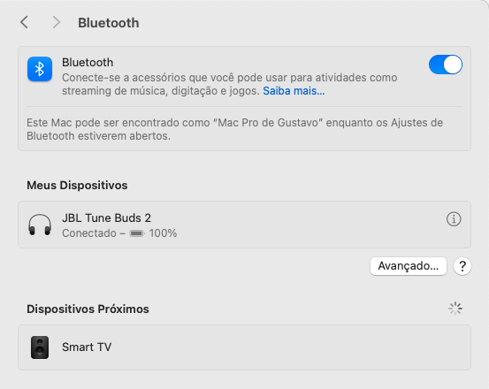
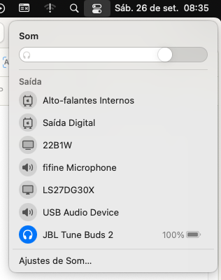

RTL8761BTFirmware
=================

[](https://github.com/gevuz/RTL8761BTFirmware/actions/workflows/build.yml)
[](LICENSE)

Firmware loader kext that makes **Realtek RTL8761BU/BUV** USB Bluetooth dongles work on macOS (Hackintosh / OpenCore), together with [BlueToolFixup](https://github.com/acidanthera/BrcmPatchRAM).

These cheap Bluetooth 5.0 dongles ship **without firmware**: the host has to upload it every time the dongle powers up. Linux does this in [`btrtl.c`](https://github.com/torvalds/linux/blob/master/drivers/bluetooth/btrtl.c), Windows has the Realtek driver, but macOS has no Realtek support at all. This kext fills that gap: at boot it uploads the official Realtek firmware from [linux-firmware](https://git.kernel.org/pub/scm/linux/kernel/git/firmware/linux-firmware.git/tree/rtl_bt), then hands the dongle over to the macOS Bluetooth stack.

## Supported devices

| USB ID | Chip | Product | Status |
|---|---|---|---|
| `2B89:6275` | RTL8761BUV | UGREEN USB Bluetooth 5.0 adapter ([Amazon BR](https://www.amazon.com.br/dp/B08R8992YC)) | ✅ Tested |

Other RTL8761BU/BUV dongles use the same firmware (`rtl8761bu_fw.bin`) and will probably work once their USB ID is added to the personality in [`Info.plist`](Info.plist) (for example the TP-Link UB500, `2357:0604`). They are **untested**: please open an issue or a pull request with your results.

To find your dongle's ID: *System Information › USB* (Product ID / Vendor ID), or `ioreg -p IOUSB -l -w0 | grep -E '"(USB Product Name|idVendor|idProduct)"'`.

## Status

Tested on macOS 15.8 Sequoia (24H23), OpenCore 1.0.7, Lilu 1.7.2, BlueToolFixup 2.7.2, on an AMD Ryzen desktop with the MacPro7,1 SMBIOS.

| Feature | Status |
|---|---|
| Firmware upload at boot | ✅ `0xdfc6d922` loaded in about 1 s |
| macOS Bluetooth on (`Chipset: THIRD_PARTY_DONGLE`) | ✅ |
| Headphones: A2DP, HFP, AVRCP, battery level (JBL Tune Buds 2) | ✅ |
| Sleep/wake | ⬜ Untested |
| Plugging the dongle while macOS is running | ⬜ Untested |
| AirDrop, Handoff and other Continuity features | ❌ Not possible: they need Apple (Broadcom) hardware |

<p align="center">
  
  &nbsp;
  
</p>
<p align="center"><sub>macOS 15.8 (Portuguese UI) with the UGREEN dongle: JBL Tune Buds 2 connected in System Settings, with its battery level, and selected as the sound output.</sub></p>

## Requirements

- macOS 12 Monterey or newer (x86_64). Since Monterey, the Bluetooth stack runs in userspace (`bluetoothd`), which is why BlueToolFixup is needed.
- [OpenCore](https://github.com/acidanthera/OpenCorePkg)
- [Lilu](https://github.com/acidanthera/Lilu) 1.5.4 or newer
- [BlueToolFixup](https://github.com/acidanthera/BrcmPatchRAM/releases) (from the BrcmPatchRAM release package)

## Installation

1. Download the [latest release](https://github.com/gevuz/RTL8761BTFirmware/releases) and copy `RTL8761BTFirmware.kext` to `EFI/OC/Kexts`. Also copy `BlueToolFixup.kext` from the BrcmPatchRAM release.
2. In `config.plist` › `Kernel` › `Add`, load them in this order (ProperTree's *OC Snapshot* takes care of it):
   1. `Lilu.kext`
   2. `BlueToolFixup.kext`
   3. `RTL8761BTFirmware.kext` (anywhere after Lilu)
3. In `NVRAM` › `Add` › `7C436110-AB2A-4BBB-A880-FE41995C9F82`, add the variables BlueToolFixup needs for third-party controllers, and list both names in `NVRAM` › `Delete` under the same GUID, so they are rewritten on every boot:

   | Key | Type | Value |
   |---|---|---|
   | `bluetoothExternalDongleFailed` | Data | `00` |
   | `bluetoothInternalControllerInfo` | Data | `0000000000000000000000000000` |

4. Reboot. *System Settings › Bluetooth* should be on. *System Information › Bluetooth* shows `Chipset: THIRD_PARTY_DONGLE` and `Firmware Version: v55586 c57286`, which is `0xd922` / `0xdfc6`, the loaded firmware.

To disable the kext without removing it, add the `-rtlbtoff` boot-arg, or simply unplug the dongle: the kext only matches its USB ID.

## How it works

1. The kext matches the dongle's `IOUSBHostDevice` by USB ID.
2. It opens the device, selects configuration 1 without registering the interfaces for matching, and reads the chip version (`HCI Read Local Version`).
3. If firmware is already running (e.g. after a restart in which the dongle kept its power), it does nothing.
4. Otherwise it reads the ROM version (`0xfc6d`), picks the matching patch from the embedded firmware file, appends the config and uploads it in 252-byte fragments (`0xfc20`), then checks that the chip reports the new version.
5. It closes everything and returns `false` from `start()`, so it does not stay attached. `bluetoothd`, patched by BlueToolFixup, then opens the dongle like any supported controller.

The Realtek firmware file is embedded **unmodified**; the patch is selected at runtime, exactly as Linux does.

## Building from source

Only the Command Line Tools are needed (`xcode-select --install`); Xcode is not required.

```bash
make firmware   # download the firmware from linux-firmware and verify it against firmware/SHA256SUMS
make            # build/RTL8761BTFirmware.kext
make check      # kernel library dependencies and byte-identical embedded firmware (needs an Intel/x86_64 host for kmutil)
make dist       # build/RTL8761BTFirmware-<version>-RELEASE.zip
make tool       # build/rtlbtctl, the userspace test tool
```

The firmware binaries are **not** stored in this repository; `make firmware` fetches them from kernel.org and verifies the SHA-256:

| File | Size | SHA-256 |
|---|---|---|
| `rtl8761bu_fw.bin` (version `0xdfc6d922`) | 44,484 bytes | `1d7a9597349ad89344fa16c1913d3e39e9a12e966e417ca16871bc79bbe59edb` |
| `rtl8761bu_config.bin` | 6 bytes | `6c28a3f07c6a30ed208c4b64862a23f02b7d93543ea980edd24df16bab45095f` |

## Test tool (`rtlbtctl`)

`rtlbtctl` talks to the dongle from userspace with the same protocol code (`src/rtl_epatch.c` is shared with the kext), without a kext or a reboot. It only works while nothing else has the dongle open, i.e. without BlueToolFixup or with Bluetooth not yet using the dongle. The firmware goes to the chip's RAM and is lost when the dongle loses power.

```bash
./build/rtlbtctl parse firmware/rtl8761bu_fw.bin firmware/rtl8761bu_config.bin 1   # parse the files only
./build/rtlbtctl info                                                              # chip and ROM version
./build/rtlbtctl upload firmware/rtl8761bu_fw.bin firmware/rtl8761bu_config.bin
./build/rtlbtctl drop                                                              # back to factory state
```

```text
version: hci_ver=0x0a hci_rev=0x000b lmp_ver=0x0a manufacturer=0x005d lmp_subver=0x8761   <- ROM (factory state)
ROM: version 1
firmware: version 0xdfc6d922, 2 patches, project ID 14; patch for ROM 1: 30204 bytes at 0x3780; config: 6 bytes; payload: 30210 bytes (120 fragments)
version: hci_ver=0x0a hci_rev=0xdfc6 lmp_ver=0x0a manufacturer=0x005d lmp_subver=0xd922   <- firmware running
```

## Troubleshooting

- **Logs:** `log show --last boot --predicate 'eventMessage CONTAINS "RTL8761BTFirmware"'` or `sudo dmesg | grep RTL8761BTFirmware`. With verbose boot (`-v`), early kernel messages can be rotated out of the buffer before you look.
- **Audio stutters or the range is short:** plug the dongle into a USB 2.0 port or use a short USB extension cable, away from USB 3 ports and the back of the case. USB 3 is a known source of 2.4 GHz interference.
- **Boot problems:** unplug the dongle or add `-rtlbtoff`.

## Protocol notes

Summarized from Linux `btrtl.c`:

- **HCI commands** go as class requests on the control endpoint (`bmRequestType 0x20`, `bRequest 0`). **Events** come from the interrupt IN endpoint of interface 0 (`0x81`, 16-byte packets) and may span several packets.
- **Identification:** `lmp_subver 0x8761`, `hci_rev 0x000b`, `hci_ver 0x0a` = RTL8761BU without firmware. Vendor command `0xfc6d` returns the ROM version.
- **"epatch" v1 file** (`Realtech` signature): project ID 14 (8761B) is found in the instructions at the end of the file. The patch whose `chip_id == rom_version + 1` is selected, its last 4 bytes are replaced by the firmware version, and the config is appended.
- **Upload:** `0xfc20` in 252-byte fragments; the index starts at 0, wraps from `0x7f` back to 1, and the last fragment has bit `0x80` set.
- **Drop firmware:** `0xfc66` (no reply), then wait 200 ms.

## Credits

- The Linux Bluetooth developers, Endless Mobile and Realtek for [`btrtl.c`](https://github.com/torvalds/linux/blob/master/drivers/bluetooth/btrtl.c), the reference for the upload protocol.
- [Acidanthera](https://github.com/acidanthera) for OpenCore, Lilu and BlueToolFixup.
- Realtek for the firmware, distributed through [linux-firmware](https://git.kernel.org/pub/scm/linux/kernel/git/firmware/linux-firmware.git).

## License

- **Code:** [GPL-2.0-or-later](LICENSE), the same license as the Linux driver it follows.
- **Firmware:** © Realtek Semiconductor Corp., redistributable in binary form without modification under [`firmware/LICENCE.rtlwifi_firmware.txt`](firmware/LICENCE.rtlwifi_firmware.txt). It is embedded unmodified in release builds and is not stored in this repository.

This project is not affiliated with Realtek, UGREEN or Apple.
